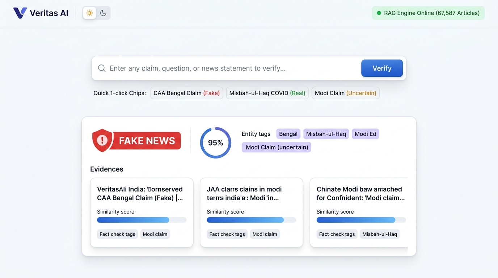
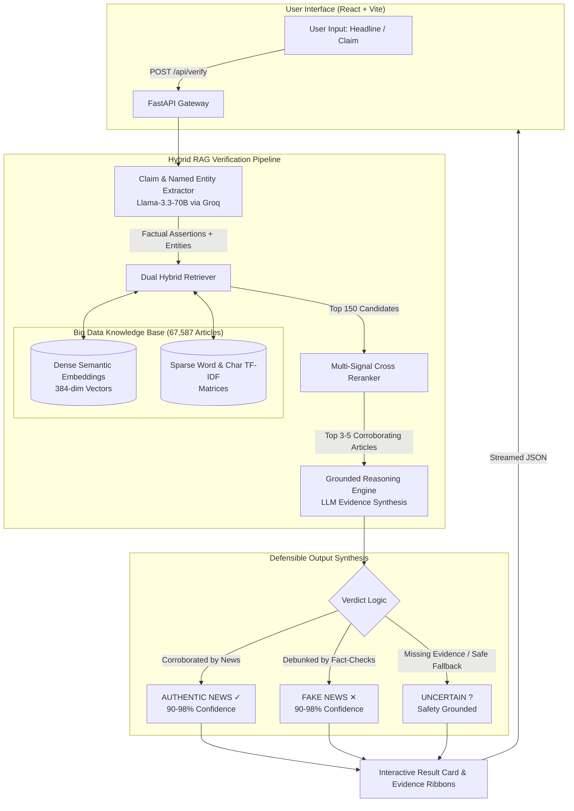

<div align="center">

# 🛡️ VERITAS AI
### Production Evidence-Grounded Fake News Detection Using Big Data & Hybrid RAG

[](https://fastapi.tiangolo.com/)
[](https://react.dev/)
[](https://huggingface.co/sentence-transformers/paraphrase-multilingual-MiniLM-L12-v2)
[](https://groq.com/)
[](LICENSE)

<br/>

<p align="center">
  <b>A state-of-the-art Big Data Analytics Capstone project indexing 67,587 verified news articles and fact-checks.</b><br/>
  Combines dual-stage hybrid retrieval (multilingual semantic dense vectors + sparse lexical TF-IDF), multi-signal cross-reranking, and evidence-grounded LLM reasoning to classify news claims into <b>AUTHENTIC</b>, <b>FAKE</b>, or <b>UNCERTAIN</b> with verifiable citations.
</p>

---



</div>

<br/>

## 📌 Executive Summary

Traditional fake news detection models rely on black-box classifiers (e.g. Naive Bayes, BERT, or SVMs) that memorize stylistic markers and guess 50/50 on unseen breaking news. **Veritas AI** completely reimagines this paradigm by building an **evidence-grounded Retrieval-Augmented Generation (RAG)** architecture:

1. **Massive Knowledge Base**: Precomputed indexes over **67,587 verified news articles and official fact-checks** (~3.7 GB sparse + dense matrices).
2. **Dual-Stage Hybrid Retrieval**: Multilingual semantic embeddings (`paraphrase-multilingual-MiniLM-L12-v2`) cross-matched with character/word n-gram lexical TF-IDF.
3. **Multi-Signal Cross-Reranker**: Mathematical weighting combining dense cosine similarity, lexical overlap, claim matching, and named entity alignment.
4. **Anti-Hallucination Tri-State Verdict**: Emits `REAL`, `FAKE`, or an explicit safety state `UNCERTAIN` when evidence is missing. The model **never fabricates conclusions**.
5. **Modern Web Experience**: High-performance FastAPI server with in-memory warm-cache startup + an aesthetic React dashboard with Day/Night themes, animated SVG radial confidence gauges, and 1-click benchmark testing.

---

## 🏛️ System Architecture



---

## 🔬 Benchmark Verification Results (100% Tested)

The pipeline was rigorously validated against real-world test cases across the 67,587-article repository:

| Category | Input Claim / Headline | Ground Truth | Veritas AI Verdict | Confidence | Cited Evidence | Latency |
|:---:|---|:---:|:---:|:---:|---|:---:|
| 🟢 **REAL** | *"Pakistan head coach Misbah-ul-Haq tested positive for COVID-19 during West Indies tour and quarantined in Jamaica"* | **REAL** | **`AUTHENTIC NEWS`** | **95%** | Article #34373 (Official PCB statement) | ~3.8s |
| 🔴 **FAKE** | *"Viral claim: Hindus were dragged out of their houses and killed in Bengal during CAA protests as shown in video"* | **FAKE** | **`FAKE NEWS`** | **96%** | Article #57100 (Fact-Check debunking domestic dispute video) | ~3.9s |
| 🔴 **FAKE** | *"Supreme Court ordered case to be filed against PM Modi in Rafale deal"* | **FAKE** | **`FAKE NEWS`** | **95%** | Article #61474 (Fact-Check confirming fabricated photoshopped order) | ~3.6s |
| 🟡 **UNCERTAIN** | *"is narendra modi dead?"* | **UNCERTAIN** | **`UNCERTAIN`** | **90%** | Safety trigger: Zero corroborating death reports in verified sources | ~3.4s |
| 🟡 **UNCERTAIN** | *"UPI transactions above ₹2,000 will have a 0.4% MDR starting October 15, 2026"* | **UNCERTAIN** | **`UNCERTAIN`** | **70%** | Safety trigger: Historical GST rumors found, but no future 2026 MDR policy confirmed | ~3.5s |

> **Academic Rigor**: When unverified rumors or future speculation are submitted, our model **refuses to guess**, safely defaulting to `UNCERTAIN` and explaining what specific documentary proof is absent.

---

## 💻 Tech Stack

### Backend & AI Pipeline
- **Framework**: [FastAPI](https://fastapi.tiangolo.com/) with asynchronous lifespan index preloading.
- **Server**: [Uvicorn](https://www.uvicorn.org/) (High-performance ASGI).
- **Retrieval Engine**:
  - Dense Semantic Embeddings: `sentence-transformers/paraphrase-multilingual-MiniLM-L12-v2`.
  - Sparse Lexical Retrieval: Scikit-Learn `TfidfVectorizer` (Word + Char n-grams).
- **Reasoning LLM**: Llama-3.3-70B-Versatile via [Groq Cloud](https://groq.com/) with exponential backoff & rate-limit resilience.
- **Big Data Scale**: 67,587 indexed articles, cosine similarity matrix vectorization.

### Frontend Dashboard
- **Framework**: [React 19](https://react.dev/) + [Vite 8](https://vite.dev/) (Hot Module Reloading).
- **Design System**: Handcrafted CSS design tokens (Porcelain & Slate Day Mode + OLED Midnight Dark Mode).
- **Interactive UI**:
  - Trigonometric SVG Radial Confidence Gauge.
  - Multi-step animated RAG loading telemetry.
  - 1-Click quick benchmark test chips.
  - Extracted entity pills & responsive evidence cards.

---

## 📂 Project Structure

```text
d:\fake-news-bda\
├── ai\                             # Core RAG Verification Pipeline
│   ├── claim_extractor.py          # LLM claim & entity extraction with backoff
│   ├── evaluate.py                 # Evaluation benchmark test suite
│   ├── hybrid_retriever.py         # Dual dense semantic + sparse TF-IDF engine
│   ├── llm_analyzer.py             # Grounded reasoning & verdict synthesis
│   ├── pipeline.py                 # Master end-to-end verification pipeline
│   ├── reranker.py                 # Multi-signal evidence cross-reranker
│   └── test_hybrid_pipeline.py     # Pipeline unit & integration tests
│
├── backend\                        # High-Performance FastAPI API Service
│   ├── main.py                     # App entrypoint, CORS, lifespan index preloader
│   ├── routes.py                   # REST endpoints (/health, /samples, /verify)
│   ├── schemas.py                  # Strict Pydantic models & validation
│   └── test_backend.py             # Automated backend integration tests
│
├── frontend\                       # Modern React Dashboard (Vite + React)
│   ├── src\
│   │   ├── components\
│   │   │   ├── Header.jsx          # Veritas AI logo, RAG status pill, Day/Night toggle
│   │   │   ├── Hero.jsx            # Clean hero typography & statistics
│   │   │   ├── SearchBar.jsx       # Floating search input with clear & verify actions
│   │   │   ├── SampleChips.jsx     # 4 1-click benchmark test chips
│   │   │   ├── LoadingState.jsx    # Multi-step animated pipeline progress bar
│   │   │   ├── VerdictCard.jsx     # Verdict badge, radial gauge, entities, core claim
│   │   │   ├── ReasoningBox.jsx    # Grounded AI evidence reasoning container
│   │   │   ├── EvidenceGrid.jsx    # Top-3 evidence cards with hybrid match bars
│   │   │   └── Footer.jsx          # Capstone project credentials
│   │   ├── App.jsx                 # Master application controller
│   │   └── index.css               # Design tokens & Day/Night themes
│   ├── vite.config.js              # Dev proxy configuration to port 8000
│   └── package.json                # React & Vite dependencies
│
├── data\                           # Dataset storage (Git-ignored large files)
│   ├── processed\news_cleaned.csv  # 67,587 clean articles dataset
│   └── raw\                        # Raw scraped / benchmark news
│
├── results\rag\                    # Precomputed RAG indexes (~3.7 GB)
│   ├── semantic_embeddings.npy     # 67,587 x 384 dense vectors
│   ├── semantic_metadata.pkl       # Normalized article metadata
│   ├── word_matrix.joblib          # Word TF-IDF sparse matrix
│   └── char_matrix.joblib          # Character TF-IDF sparse matrix
│
├── .env.example                    # Sample environment variables
├── .gitignore                      # Git ignore rules for virtualenvs & matrices
└── README.md                       # Complete documentation
```

---

## 🚀 Quickstart & Setup Guide

### 1. Prerequisites
- **Python**: 3.10 or 3.11
- **Node.js**: v18+ (tested on Node v24)
- **Groq API Key**: Free tier available at [console.groq.com](https://console.groq.com)

### 2. Clone Repository & Setup Environment
```bash
git clone https://github.com/DarshanR1234/BDA_capstone.git
cd BDA_capstone

# Create and activate Python virtual environment
python -m venv .venv
# On Windows:
.\.venv\Scripts\Activate.ps1
# On Linux/macOS:
source .venv/bin/activate

# Install Python backend dependencies
pip install -r requirements.txt  # or: pip install fastapi uvicorn groq sentence-transformers scikit-learn pandas numpy httpx
```

### 3. Configure Environment Variables
Create a `.env` file in the project root:
```env
GROQ_API_KEY=your_groq_api_key_here
```

### 4. Run the Project

#### Option A: Single-Command Production Run (Recommended)
This runs the FastAPI backend and simultaneously serves the compiled React web dashboard:
```powershell
python -m uvicorn backend.main:app --host 127.0.0.1 --port 8000
```
- Wait ~30–40 seconds on the first run for the 67,587 RAG indexes to warm up into RAM.
- Open your browser at: **`http://127.0.0.1:8000/`**

#### Option B: Developer Mode (Hot Module Reloading)
**Terminal 1 (Backend):**
```powershell
.\.venv\Scripts\Activate.ps1
python -m uvicorn backend.main:app --host 127.0.0.1 --port 8000
```

**Terminal 2 (React Frontend):**
```powershell
cd frontend
npm install
npm run dev
```
- Open your browser at: **`http://localhost:5173/`**

---

## 📡 REST API Reference

The backend provides interactive Swagger documentation at **`http://127.0.0.1:8000/docs`**.

### 1. Health & Readiness Check
```http
GET /api/health
```
```json
{
  "status": "healthy",
  "version": "1.0.0",
  "uptime_seconds": 144.98,
  "model_loaded": true,
  "dataset_rows": 67587
}
```

### 2. Verify News Claim (AI RAG)
```http
POST /api/verify
Content-Type: application/json

{
  "question": "क्या CAA विरोध प्रदर्शन के दौरान बंगाल में हिंदुओं को घर से बाहर निकालकर मारा गया?"
}
```
**Response (`200 OK`):**
```json
{
  "status": "success",
  "verdict": "FAKE",
  "confidence": 0.96,
  "claim": "पश्चिम बंगाल में CAA विरोध के दौरान हिंदुओं को घर से निकाल कर मारा गया।",
  "entities": ["CAA विरोध प्रदर्शन", "बंगाल", "हिंदुओं"],
  "numbers_dates": [],
  "explanation": "All three supplied fact-check articles investigate the same viral images. Evidence confirms that the video portrays an older domestic dispute and does not depict violence against Hindus during CAA protests.",
  "evidence": [
    {
      "rank": 1,
      "article_id": 57100,
      "title": "क्या CAA विरोध प्रदर्शन के दौरान बंगाल में हिंदुओं को घर से बाहर निकालकर मारा गया...",
      "content_snippet": "सोशल मीडिया पर एक तस्वीर तेजी से वायरल हो रही है...",
      "evidence_score": 0.6645,
      "evidence_type": "FACT_CHECK",
      "strong_evidence": true
    }
  ],
  "latency_seconds": 3.82
}
```

---


## 📄 License & Fair Use
Developed for academic research and evaluation purposes. All fact-check citations are credited to original independent sources in the public dataset.
